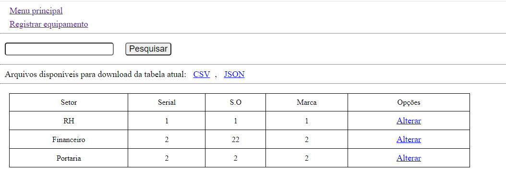
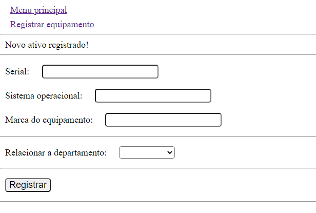

## CRUD simples

Utilizando de PHP + Mysql para gerar um exemplo de aplicação simples CRUD que pode exportar arquivos do select (tabela do menu principal);

---

### Requisitos
* PHP 7.4 (Utilizado para os testes);
* Apache2 (Servidor Web);
* Mysql (Banco de dados);

---

### Instalar

```
apt install php
apt install apache2 -y 
apt install mariadb-server
apt install php-mysql
```

---

### Imagens 


